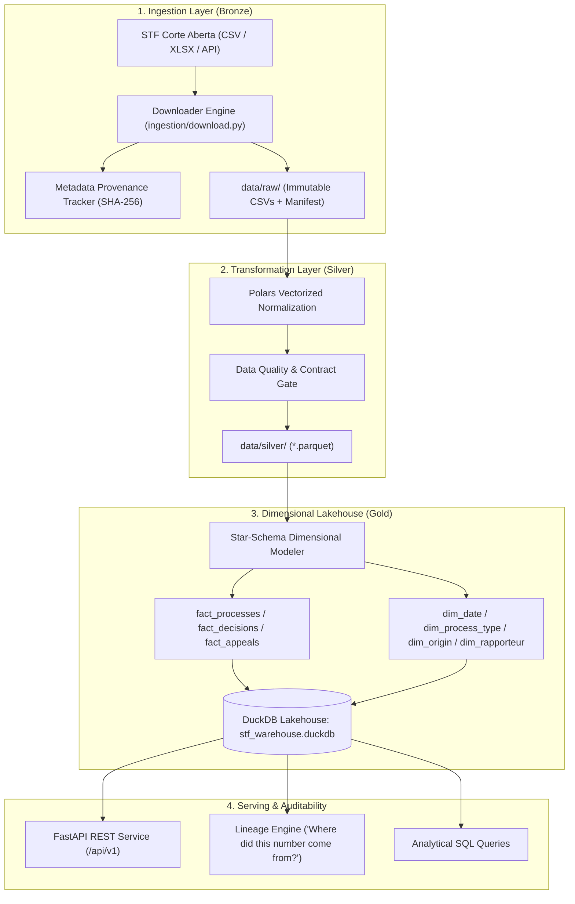

# 🇧🇷 STF Transparency Platform

> **Open-source modern data lakehouse, survival analytics engine, and transparency platform for the Brazilian Supreme Court (*Supremo Tribunal Federal* - STF / *Corte Aberta*).**

[](https://github.com/Gcarmnonapy7/stf_data_analysis/actions)
[](https://www.python.org/downloads/)
[](https://opensource.org/licenses/MIT)
[](https://duckdb.org/)
[](https://iceberg.apache.org/)
[](https://fastapi.tiangolo.com/)
[](https://www.docker.com/)

---

## 🎯 Mission & Purpose

The **STF Transparency Platform** is a serious, open-source data engineering and analytics platform that collects, transforms, stores, and exposes public datasets from the Brazilian Supreme Federal Court (*Corte Aberta* / Resolução nº 774/2022).

The purpose of this platform is **not** to dictate opinion on judicial decisions, but to provide a reproducible, auditable analytical layer over the Court's open-data ecosystem. It transforms heterogeneous raw CSV/XLSX downloads into a documented dimensional lakehouse accessible via high-performance SQL, Parquet, and an open REST API.

---

## 🏗️ Architecture



---

## 📦 Data Layers (Medallion Architecture)

### 🥉 1. Bronze — Raw (`data/raw/`)
Stores the original STF files exactly as downloaded. Raw data is strictly immutable.
Every ingestion logs an audit record in `data/metadata/manifest.jsonl` with:
- `source_url`
- `download_timestamp` (ISO 8601 UTC)
- `file_hash_sha256`
- `dataset_version`
- `row_count` and `file_size_bytes`

### 🥈 2. Silver — Clean & Normalized (`data/silver/`)
High-performance normalization powered by **Polars**:
- Canonical `snake_case` column naming.
- Strict type casting (`pl.Int64`, `pl.Date`, `pl.Utf8`).
- Deduplication on primary keys (`process_id`, `decision_id`).
- Standardized macro decision categories (`MONOCRATICA`, `COLEGIADA`, `PRESIDENCIA`).
- Normalized Brazilian state codes (`uf_origem`).
- Compressed, columnar storage in **Parquet (ZSTD)**.

### 🥇 3. Gold — Analytical Star Schema (`data/curated/`)
Curated dimensional models optimized for OLAP aggregations:
- **Facts**: `fact_processes`, `fact_decisions`, `fact_appeals`
- **Dimensions**: `dim_date`, `dim_process_type`, `dim_rapporteur`, `dim_origin`, `dim_subject`
- **Engine**: Embedded **DuckDB** (`stf_warehouse.duckdb`) enabling serverless, zero-copy analytics.

---

## 🔥 Data Lineage: "Where did this number come from?"

Every metric, dataset, and API response can be traced vertically to its exact raw source file and ingestion manifest.

```
Dashboard / API
      │
      ▼
SQL Analytical Query
      │
      ▼
Gold Dataset (fact_decisions)
      │
      ▼
Polars Normalization (v0.1.0-clean)
      │
      ▼
Silver Parquet (silver/decisoes.parquet)
      │
      ▼
Raw CSV (raw/decisoes/decisoes_raw.csv | SHA-256: 0304d4471a9c...)
      │
      ▼
STF Corte Aberta (Portal STF / Resolução 774/2022)
```

Example response from `/api/v1/lineage/fact_decisions`:
```json
{
  "target_entity": "fact_decisions",
  "validation_status": "PASS",
  "lineage_nodes": [
    {
      "layer": "GOLD_ANALYTICAL",
      "name": "fact_decisions",
      "version": "v0.1.0-star",
      "row_count": 1513
    },
    {
      "layer": "SILVER_CLEAN",
      "name": "silver/decisoes.parquet",
      "version": "v0.1.0-clean",
      "row_count": 1513
    },
    {
      "layer": "BRONZE_RAW",
      "name": "raw/decisoes/decisoes_raw.csv",
      "hash_or_checksum": "0304d4471a9c45420fd32d49a7dc71bb4ab6716df0c182c574b9ebf41c921cb6",
      "row_count": 1513
    },
    {
      "layer": "SOURCE",
      "name": "STF Corte Aberta",
      "version": "Official Portal"
    }
  ]
}
```

---

## 🧪 Data Quality Contracts

Automated quality gates execute as part of the pipeline run (`quality/runner.py`):
- [x] **Primary Key Uniqueness**: Zero duplicate `process_id` or `decision_id` entries.
- [x] **Not-Null Critical Fields**: Mandatory identifiers and distribution dates.
- [x] **Date Sanity**: No impossible or future dates.
- [x] **Referential Temporal Consistency**: Decision date $\ge$ Distribution date.
- [x] **Categorical Validity**: State codes strictly validated against ISO 3166-2:BR.
- [x] **Checksum Integrity**: Re-verified against ingestion manifests.

---

## 🚀 Quickstart

### Prerequisites
- Python 3.10+
- `make` (optional) or standard virtual environment

### 1. Installation
```bash
# Clone the repository
git clone https://github.com/Gcarmnonapy7/stf_data_analysis.git
cd stf_data_analysis

# Set up environment and install dependencies
make install
# or:
python3 -m venv .venv
.venv/bin/pip install -r requirements.txt
```

### 2. Run the Full End-to-End Pipeline
```bash
# Ingests, normalizes, validates, and builds DuckDB star-schema:
make pipeline
# or:
.venv/bin/python -m pipelines.runner --sample --rows 1000
```

### 3. Run Automated Tests
```bash
make test
# or:
.venv/bin/pytest tests/ -v
```

### 4. Launch the REST API
```bash
make api
# or:
.venv/bin/uvicorn api.main:app --host 0.0.0.0 --port 8000 --reload
```
Navigate to interactive OpenAPI documentation at **`http://localhost:8000/docs`**.

---

## 📊 Analytical Insights (DuckDB Queries)

Core analytical queries are documented in [`analytics/sql/kpis.sql`](analytics/sql/kpis.sql):
- **Annual Case Inflow & Backlog Trends**
- **Distribution by Legal Class** (`ADI`, `RE`, `HC`, `ARE`, `ADPF`, etc.)
- **Monocratic vs. Collegiate Decision Ratios**
- **Outcome Distribution** (`Provido`, `Não Provido`, `Negado Seguimento`, etc.)
- **Decisions by Reporting Justice** (*Relator*)
- **Lead Time from Distribution to Decision**

---

## 📁 Repository Layout

```
stf-transparency-platform/
├── README.md               # Project overview, architecture, and documentation
├── pyproject.toml          # Project configuration, dependencies, and tools
├── requirements.txt        # Pinned virtual environment dependencies
├── Makefile                # Automation CLI targets (pipeline, quality, lakehouse, etc.)
├── Dockerfile              # Production multi-stage hardened OCI container
├── docker-compose.yml      # Local dev and orchestration (API + Grafana)
│
├── .github/                # Production CI/CD automation
│   └── workflows/
│       ├── ci.yml          # Multi-python matrix testing & quality gate
│       └── release.yml     # Automated GHCR OCI container publishing
│
├── ingestion/              # Ingestion layer (Bronze)
│   ├── download.py         # Resilient HTTP extractor for Corte Aberta
│   ├── crawler.py          # State-aware incremental crawler with watermarks
│   ├── metadata.py         # SHA-256 provenance tracker
│   └── fixtures.py         # Schema-valid synthetic sample generator
│
├── scripts/                # Automation scripts
│   └── cron_crawler.sh     # Shell wrapper with flock concurrency lock for cron
│
├── transformations/        # Vectorized Polars transformations (Silver)
│   ├── processes.py        # Case normalization and deduplication
│   ├── decisions.py        # Decision categorization (Monocrática/Colegiada)
│   ├── appeals.py          # Appeals & Repercussão Geral
│   └── administrative.py   # Personnel, payroll, and budget execution
│
├── quality/                # Data quality & governance
│   ├── runner.py           # Automated test assertions & contracts (100% pass)
│   └── lineage.py          # Traceability engine ("Where did this number come from?")
│
├── pipelines/              # Master pipeline orchestration
│   ├── runner.py           # Medallion lifecycle runner
│   ├── gold/builder.py     # Star-schema dimensional lakehouse builder
│   └── export/             # Open Lakehouse export engine
│       └── lake_formats.py # Delta Lake (_delta_log) & Apache Iceberg v2 exporter
│
├── analytics/              # Analytical lakehouse & statistical modeling
│   ├── duckdb_client.py    # DuckDB client connection manager
│   ├── survival.py         # Kaplan-Meier process backlog survival estimator
│   ├── run_analysis.py     # Executive report generator
│   ├── sql/kpis.sql        # Standard analytical queries
│   └── notebooks/          # Reproducible research notebooks
│       ├── 01_exploratory_analysis.ipynb
│       └── 02_temporal_survival_analysis.ipynb
│
├── api/                    # Serving REST API (FastAPI)
│   ├── main.py             # App entrypoint (v1.0.0)
│   ├── schemas/models.py   # Pydantic models
│   ├── templates/          # Responsive dashboard with DuckDB-Wasm & Kaplan-Meier
│   │   └── dashboard.html
│   └── routes/             # Endpoints
│       ├── processes.py    # Case records queryable endpoint
│       ├── decisions.py    # Judicial decisions endpoint
│       ├── administrative.py# Budget, remuneration, and personnel
│       ├── analytics.py    # KPIs, judge caseload, survival analysis, SQL console
│       ├── export.py       # High-speed streaming (CSV, NDJSON, Parquet)
│       └── lineage.py      # Full data lineage trace
│
├── dashboard/              # Visualization packages
│   ├── grafana/            # Pre-configured Grafana dashboard & datasource
│   └── superset/           # Apache Superset dashboards & import instructions
│
├── docs/                   # Engineering documentation
│   ├── architecture.md     # Architecture documentation
│   ├── data_dictionary.md  # Detailed schema definitions
│   ├── methodology.md      # Neutrality principles and metric math
│   └── linkedin_announcement.md # Complete publication kit (PT/EN + Carousels)
│
├── data/                   # Data lakehouse directory (local storage)
│   ├── raw/                # Bronze immutable files + watermarks
│   ├── silver/             # Silver clean Parquet tables
│   ├── curated/            # Gold dimensional models & DuckDB warehouse
│   ├── exports/            # Exported Delta Lake & Apache Iceberg tables
│   └── metadata/           # Ingestion manifests and watermarks
│
└── tests/                  # Pytest test suite (100% passing)
    ├── test_ingestion.py
    ├── test_transformations.py
    ├── test_administrative.py
    ├── test_crawler.py
    ├── test_lake_export.py
    ├── test_survival.py
    ├── test_quality.py
    ├── test_api.py
    ├── test_export_api.py
    └── test_analysis.py
```

---

## 🗺️ Roadmap & Milestones

- [x] **v0.1 — MVP Scaffolding & Core Architecture**
  - [x] Automated downloader & sample fixture generator
  - [x] SHA-256 metadata provenance tracking (`manifest.jsonl`)
  - [x] Polars Bronze $\rightarrow$ Silver transformations
  - [x] Gold dimensional star-schema (`fact_processes`, `fact_decisions`, `dims`)
  - [x] Embedded DuckDB lakehouse integration
  - [x] Data Quality assertion gate (11 automated checks)
  - [x] End-to-end data lineage engine
  - [x] FastAPI REST service with OpenAPI documentation
  - [x] Comprehensive Pytest test suite
- [x] **v0.2 — Data Engineering Scaling**
  - [x] Scheduled recurring incremental crawlers (`cron` / `scripts/cron_crawler.sh`)
  - [x] DuckDB Iceberg / Delta Lake export options (`pipelines/export/lake_formats.py`)
  - [x] Administrative domain data (*Remuneração, Orçamento, Pessoal*)
- [x] **v0.3 — Analytics & Notebooks**
  - [x] Reproducible Jupyter exploratory notebooks (`01_exploratory_analysis.ipynb`, `02_temporal_survival_analysis.ipynb`)
  - [x] Temporal survival analysis on process backlog (Kaplan-Meier estimator & backlog half-life)
- [x] **v0.4 — Advanced Serving**
  - [x] DuckDB WebAssembly (Wasm) client-side in-browser querying
  - [x] Chunked streaming export endpoints (Streaming CSV, JSON Lines / NDJSON, Parquet)
- [x] **v0.5 — Dashboard**
  - [x] Pre-configured Grafana dashboard (Caseload, distribution, budgets)
  - [x] Pre-configured Apache Superset dashboard export package
- [x] **v1.0 — Public Platform Deployment**
  - [x] Automated CI/CD GitHub Actions workflow (`ci.yml` on Python 3.11/3.12)
  - [x] Public container registry release (`release.yml` for GHCR OCI images)
  - [x] Multi-stage hardened production Dockerfile with non-root security

---

## 📜 License
 
Licensed under the [MIT License](LICENSE).

